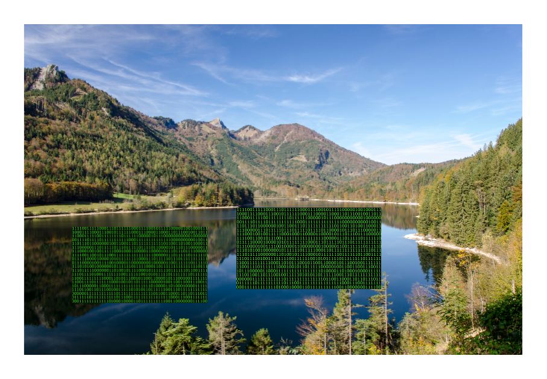

# Stash Architecture

## Agenda

* Data

* Bank platform

## Data
---

---

---

---

---

## Data LAKE

---

### ITS A LAKE... OF Data

@ul
- @size[65%](centralizes all of our data)
- @size[65%](mixpanel, braze, plaid, green dot, backend events)
- @size[65%](use case driven views)
@ulend
---

## Service View

---

## Questions

😬
